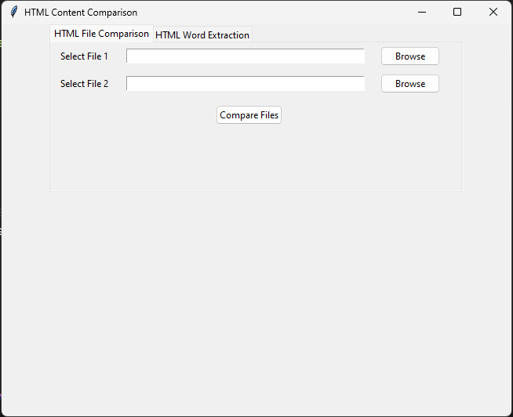
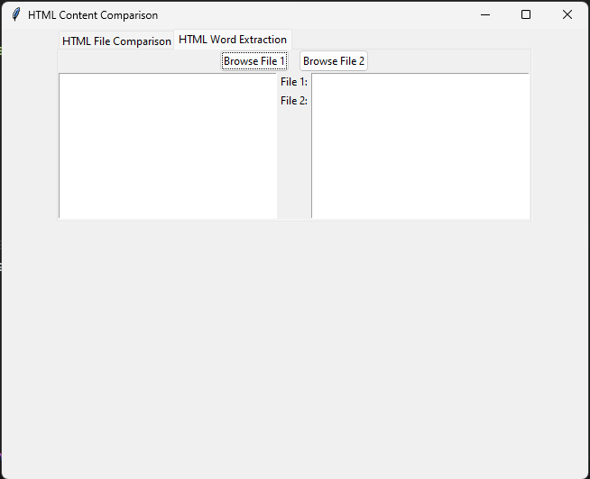

## HTML Content Comparison

This tool can compare between two htm/html file and check if there is any mismatch between the two html file.

If there is any mismatch or not, it will display the output accordingly.

**Run the below code to convert the script file to exe**

```
pyinstaller --onefile --hidden-import=bs4 --hidden-import=your_other_module HTML_CC.py -w
```

_OR_

```
pyinstaller --onefile --hidden-import=bs4 HTML_CC.py -w
```

_OR_ download HTML*CC.exe v0.1 from release. \_make sure windows defender is off during the download and runtime or it will be detected as a virus which is not*



